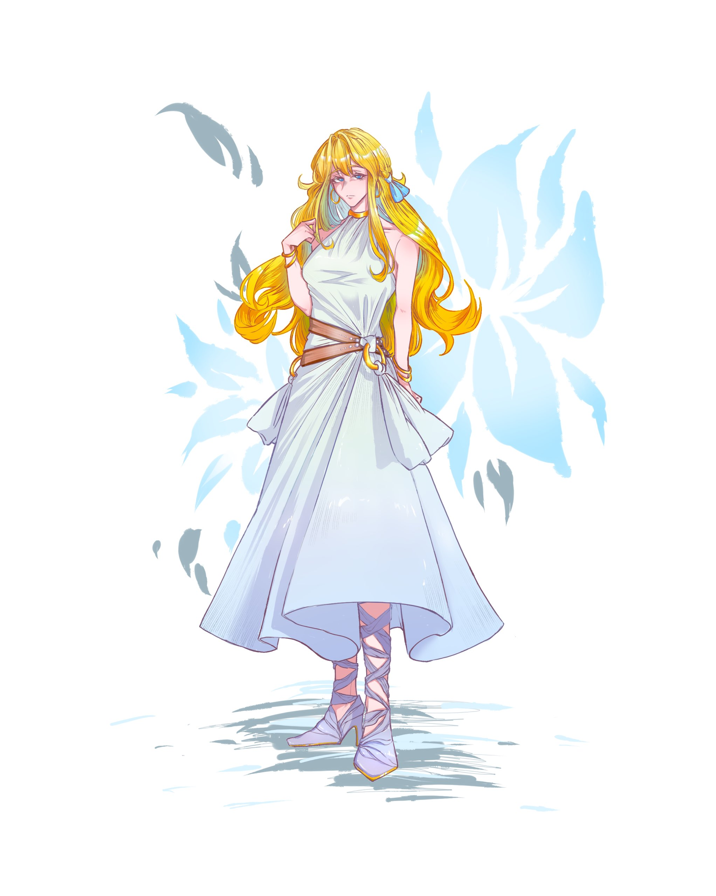

<!-- 以下是角色立绘+简介的核心内容，替换掉原来的论文文字 -->

  <!-- 立绘+简介布局容器 -->
  

    <!-- 左侧：角色立绘 -->
    

      <!-- 替换下面的链接为你的角色立绘链接 -->
      
    

    <!-- 右侧：角色简介卡片 -->
    

      <h1 style="color: #333; margin-bottom: 20px;">你的角色名称</h1>
      

        

          <strong>年龄：</strong>填写角色年龄
        

        

          <strong>性格：</strong>填写角色性格（比如：活泼开朗、外冷内热）
        

        

          <strong>背景：</strong>填写角色简介（比如：来自奇幻世界的冒险者，喜欢甜食和冒险）
        

        

          <strong>喜好：</strong>填写角色喜好（比如：甜食、星空、小动物）
        

      

    

  

