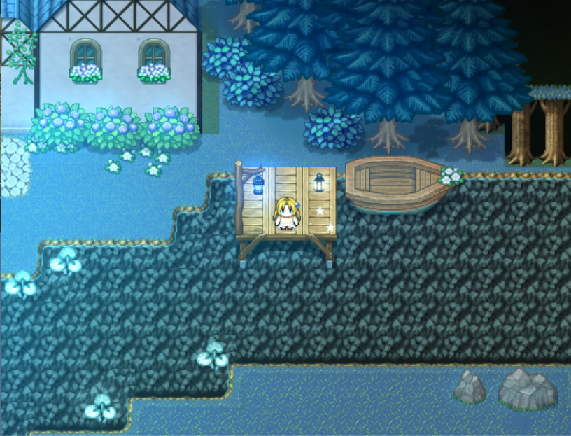
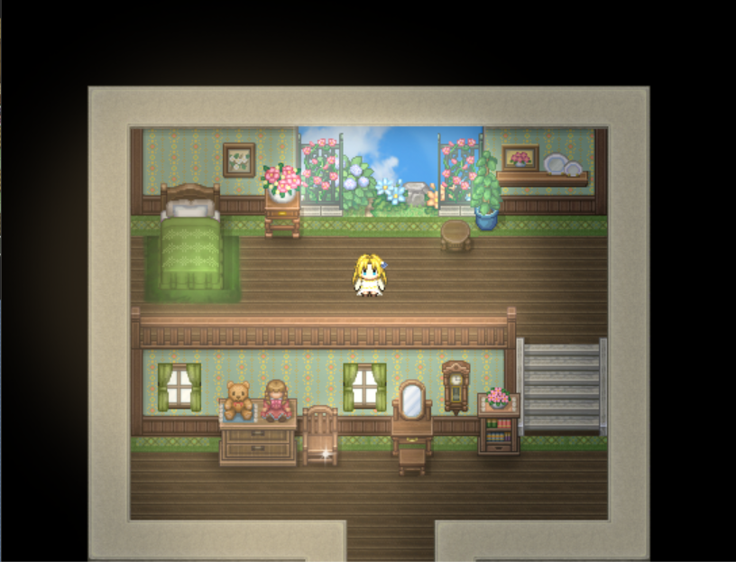
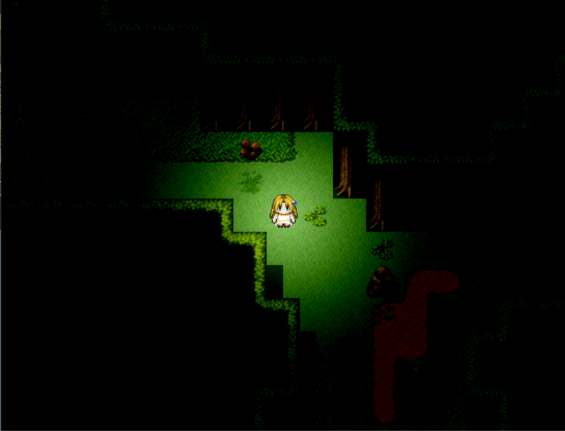

  <!-- 第一张图：替换成你的image1.png直链 -->
  

    
    
游戏场景1

  

  <!-- 第二张图：替换成你的image2.png直链 -->
  

    
    
游戏场景2

  

  <!-- 第三张图：替换成你的image3.png直链 -->
  

    
    
游戏场景3

  

  <!-- 第四张图：替换成你的image4.png直链 -->
  

    
    
游戏场景4

  

